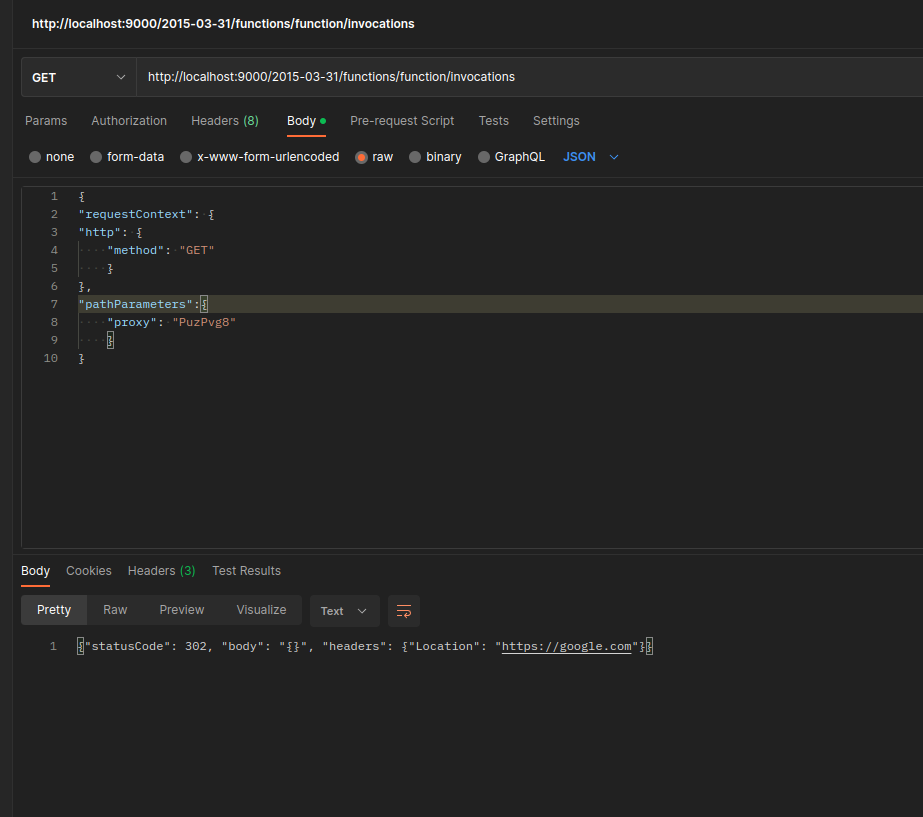
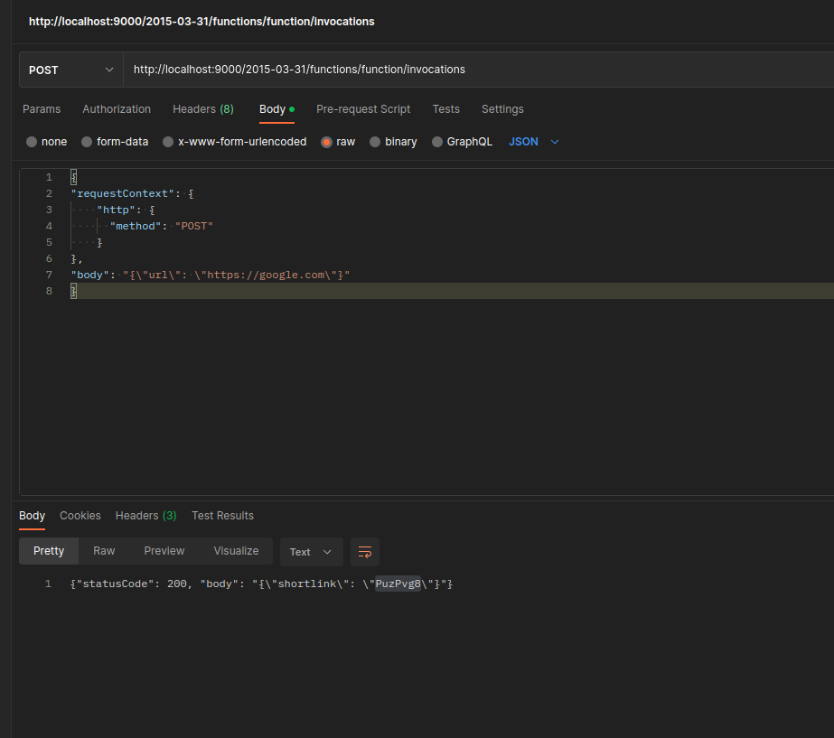
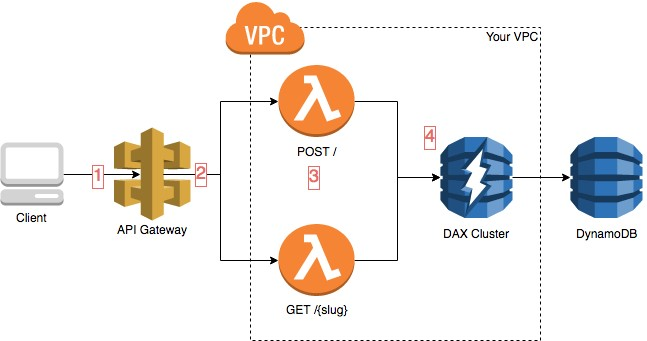

<p align="center">
<a href="https://github.com/i11matic/aws-lambda-url-shortener/blob/master/LICENSE" title="License">
 License"/>
</a>
<a href="https://github.com/i11matic/aws-lambda-url-shortener/fork" title="Forks">
 Forks"/>
</a>
<a href="https://github.com/i11matic/aws-lambda-url-shortener/stargazers" title="Stars">
 Stars"/>
</a>
<a href="https://github.com/i11matic/aws-lambda-url-shortener/issues" title="Issues">
 Issues"/>
</a>
<a href="https://github.com/i11matic/aws-lambda-url-shortener/pulls" title="Pull Requests">
 Pull Requests"/>
</a>
<a href="https://github.com/i11matic/aws-lambda-url-shortener" title="Repo Size">
 Repo Size"/>
</a>
<a href="https://open.vscode.dev/i11matic/aws-lambda-url-shortener" title="Open in VSCode">

</a>
<a href="https://github.dev/i11matic/aws-lambda-url-shortener" title="Open in VSCode Web">

</a>
</p>

# AWS Lambda URL Shortener

## Description

- This application is a URL shortener that is made for  AWS lambda, built in python
- This repo is only for the application code, and outputs a docker container
- [Deployment code via AWS CDK](https://github.com/i11matic/aws-cdk-url-shortener)
- [Deployment of required infrastructure via Terraform](https://github.com/i11matic/api-gateway-dynamodb-terraform)

## Table of Contents

- [AWS Lambda URL Shortener](#aws-lambda-url-shortener)
	- [Description](#description)
	- [Table of Contents](#table-of-contents)
	- [Prerequisites](#prerequisites)
	- [Installation](#installation)
	- [Local Development](#local-development)
		- [Examples](#examples)
	- [Architecture](#architecture)
	- [License](#license)


## Prerequisites
- [Python 3.9](https://www.python.org/downloads/release/python-390/)
- [Docker](https://docs.docker.com/get-docker/)
- [Pip](https://pip.pypa.io/en/stable/installation/)
- [Configured AWS Credentials](https://docs.aws.amazon.com/cli/latest/userguide/cli-configure-files.html)


## Installation
**Note**: depending on how you installed *python* and *pip*, the commands may not need the *3* at the end.

```
python3 -m venv .venv
source .venv/bin/activate
pip3 install -r requirements.txaw
```
## Local Development

Building the Container

```
docker build . -t url-shortener
```

Start the local dynamodb Container
```
docker run -d amazon/dynamodb-local -p 8000:8000
```

Running the container
```
docker run --add-host=host.docker.internal:host-gateway \
--env DYNAMODB_ENDPOINT_URL="http://host.docker.internal:8000" \
--env AWS_ACCESS_KEY_ID=$AWS_ACCESS_KEY_ID \
--env AWS_SECRET_ACCESS_KEY=$AWS_SECRET_ACCESS_KEY \
--env AWS_DEFAULT_REGION=$AWS_DEFAULT_REGION -p 9000:8080  url-shortener
```

Local Developement Endpoint
```
http://localhost:9000/2015-03-31/functions/function/invocations
```

To create a short url the code reads the following fields, adjust these for your testing

```
{
	"requestContext": {
		"http": {
			"method": "POST"
		}
	},
	"body": "{\"url\": \"https://google.com\"}"
}

```

To get back the original URL the code reads the following fields, adjust these for your local testing
```
{
	"requestContext": {
		"http": {
			"method": "GET"
		}
	},
	"pathParameters": {
		"proxy": "DjWoSps"
	}
}
```
### Examples




## Architecture
- AWS API Gateway to provide REST endpoints for the lambda functions
- Lambda for execution of the runtime environment
  - Lambda for the URL shortener
  - Lambda Authorizer on */post* route for adminstrator functions (adding urls to the Dynamodb table)
  - provisioned concurrency enabled to allow parallel executions
  - ability to use account reserved concurrency
- Dynamodb for key/value storage of the short URLS and Original URLS
- Dynamodb Acelerator (DAX) for caching
- Route 53 to allow custom domain for the API gateway





## License

GNU General Public License v3.0
